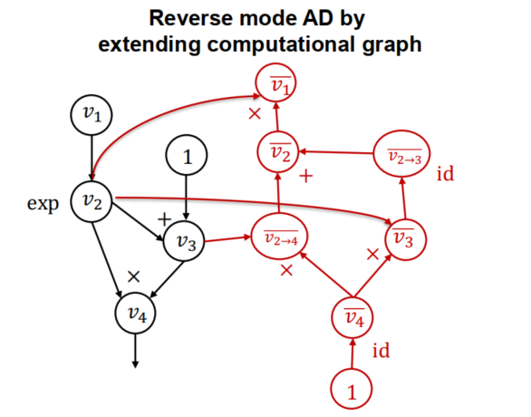

# Q.1
np的transpose需要所有维度的排序索引来重拍，因此直接调用transpose无法过测试。可以用swapaxe，也可以生成arrange列表后交换axes的两个下标。


# Q.2
broadcast
广播规则从尾部（右侧）开始对齐维度，这是因为在许多实际应用中，最后几个维度通常表示数据的主要结构（如图像的高度和宽度），而前面的维度可能表示批量大小或其他高维特征。因此，从尾部对齐可以确保这些关键维度能够正确地进行广播。
所以在实现广播的梯度的时候，记得对齐的时候是从右侧开始对齐的。
例如
```md
A: (3, 4)
B:    (4,)

A: (3, 4)
B: (1, 4)

broadcast->B: (3, 4)
```

记得Q.1部分各个计算`forward`函数的参数类型，输入`list`是不能过的。


# Q.3
拓扑排序，递归到最深节点（没有输入节点或者输入节点已被加入拓扑排序结果），加入拓扑排序。

# Q.4
按照流程图实现。遍历到每个节点的时候，逆序拓扑已经保证了，当前节点的node_to_grad内已经记录了所有后续节点需要传递给当前节点的partial grad，只需要对当前节点的node_to_grad内的$\overline{V_{i \to j}}$求和即可。求和完即获得了当前节点的偏导数。

然后根据当前节点的偏导数，获取当前节点的`inputs`，调用当前节点`op`对应的`gradient`，自动计算出输入当前节点的所有节点的$\overline{V_{i \to j}}$。

`partial_adjoint = node.op.gradient_as_tuple(adjoint, node)`
`adjoint`是当前节点计算完自身的偏导，`node`代表当前节点。但是其实观察代码可以发现，在计算出梯度之后，`adjoint`可以赋值给`node.grad`，可以不需要传入这个参数？maybe。


# Summary

不管事前向传播还是反向传播，都是计算图的构建，Tensor在进行算数运算的时候，就会自动创建新的计算节点。在前向传播中，计算图的构建是人为给定的（用户输入了计算函数，搭建了网络等等）。在反向传播中，我们在`gradient`函数内定义了反向传播时需要进行的`Tensor`计算。正如PPT的图，当我们在遍历正向传播节点的拓扑排序时，我们会用到前向传播计算图节点的`inputs`和`op`，`gradient`计算时获取了这些信息，并创建新的节点。

前向传播和反向传播都需要调用`Tensor`内的运算符重载->`Tensor.make_from_op`->创建新的节点，填充`inputs`和`op`，调用`realize_cached_data`计算`cache_data`。

总结：只要涉及到Tensoer计算，就会产生新的节点，新的节点通过`inputs`和`op`记录来自哪里以及是通过何种计算获得。反向传播时通过我们事先定义的每个运算符的偏导，人工地设计了对应的计算公式。`sum_node_list`把每一个路径的偏导求和得到节点最终偏导也会创建新的计算节点。



